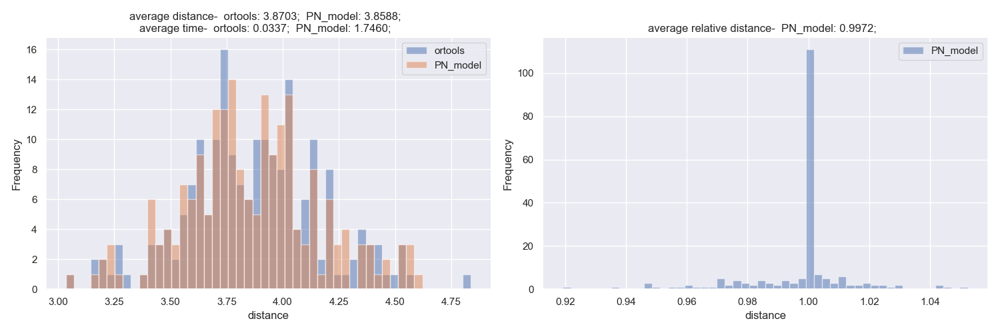
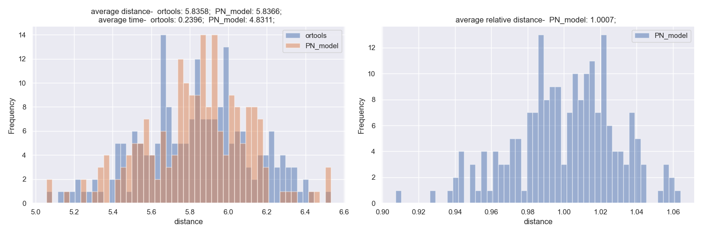
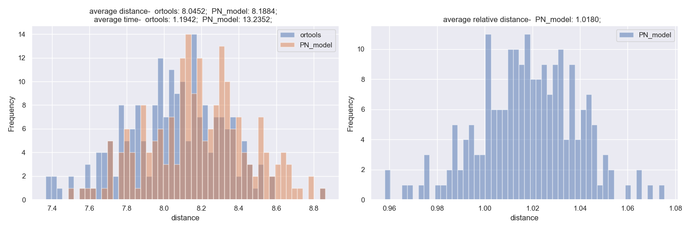

# rl-optimize

The main objective of this repository is to research and develop optimization problem (such as TSP, VRP, MIP etc.) solvers based on recent ML and RL introductions to this field. 

Our current works are very limited to a bunch of specific problem solvers and we will focus on building ML models or a single model if possible to solve all types of optimization problems.

The true nature of this repository will be to provide high quality open source implementations but at the same time will also be kept private partially of under-development works.


# Dependencies

All dependecies are listed inside requirements.txt except Pytorch library.


# Installation

Open command line and type
```
git clone git@github.com:abdullah-al-masud/rl-optimize.git
cd rl-optimize
pip install -r requirements.txt
```

Last command's "pip" portion may vary based on OS or Anaconda.

To install Pytorch, please check the installation procedures here- https://pytorch.org/.


# Results

## TSP

We have used google ORtools to benchmark our results. We trained our models in a low-spec GPU, so the computation time shown in below images are to be ignored. Also due to limitation of compution resulrce, our models were not trained with proper number of epochs as specified in google paper [Neural Combinatorial Optimization with Reinforcement Learning](https://arxiv.org/abs/1611.09940). Yet the result is very close to what the paper mentioned.

The results are shown below-

For TSP-20


For TSP-50


For TSP-100



# Contributors

We are actively searching for researchers and contributors who can help us building this open source library and will be joining the team to serve mankind with advanced ML based optimization solutions.
